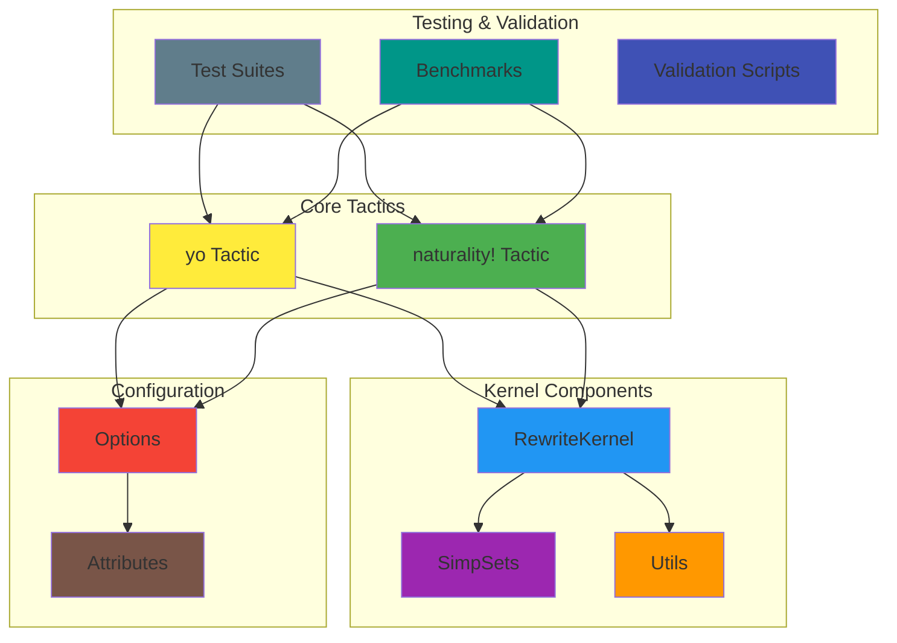

<div align="center">

# LeanYo

**A Lean 4 tactic library that simplifies category theory proofs using (co)Yoneda isomorphisms**

[](https://opensource.org/licenses/MIT)
[](https://leanprover-community.github.io/)
[](https://github.com/leanprover-community/mathlib4)
[](https://github.com/fraware/lean-yo)

*Transform complex category theory proofs into elegant, readable solutions*

</div>

## Overview

**LeanYo** revolutionizes category theory proof development in Lean 4 by providing powerful tactics that leverage the fundamental (co)Yoneda isomorphisms. Whether you're working with functors, natural transformations, or complex categorical diagrams, LeanYo makes your proofs more intuitive and maintainable.

### Key Features

- **`yo` Tactic**: Transforms morphism goals into pointwise goals using (co)Yoneda isomorphisms
- **`naturality!` Tactic**: Automatically closes standard naturality squares and whiskering equations
- **Safe & Robust**: Minimal configuration with safe defaults and robust performance on large diagrams
- **Readable**: Provides clear explanations and debug information
- **Configurable**: Flexible options for different use cases and performance requirements

### Visual Concept

The library is built around the powerful Yoneda Lemma, which states that every object in a category can be understood through its relationships with all other objects:

```mermaid
graph TB
    A[Object X] --> B[Functor Hom(-,X)]
    B --> C[Natural Transformations]
    C --> D[Pointwise Properties]
    
    E[Complex Morphism Goal] --> F[yo Tactic]
    F --> G[Pointwise Goal]
    G --> H[Easier to Prove]
    
    I[Naturality Square] --> J[naturality! Tactic]
    J --> K[Automatic Solution]
    
    style A fill:#e1f5fe
    style E fill:#fff3e0
    style I fill:#f3e5f5
    style H fill:#e8f5e8
    style K fill:#e8f5e8
```

### Library Architecture

LeanYo is built with a modular architecture that separates concerns and provides clean interfaces:



## 🚀 Quickstart

### One-Command Install & Run

**Option 1: Docker (Recommended)**
```bash
# Run LeanYo instantly with Docker
docker run --rm ghcr.io/fraware/lean-yo:latest --help
```

**Option 2: Add to Your Lean Project**
```bash
# Add this line to your lakefile.lean
require lean-yo from git "https://github.com/fraware/lean-yo.git"

# Then update and build
lake update
lake build
```

### Quick Test Drive

Try LeanYo immediately with these copy-paste commands:

```bash
# Test the Docker image
docker run --rm ghcr.io/fraware/lean-yo:latest --examples

# Or run interactively
docker run -it --rm ghcr.io/fraware/lean-yo:latest bash
```

### Development Setup

```bash
# Clone and set up development environment
git clone https://github.com/fraware/lean-yo.git
cd lean-yo
make dev    # Sets up everything you need
make run    # Test the library
```

## Installation Options

### 🐳 Docker (Zero Setup)

**Run Examples:**
```bash
docker run --rm ghcr.io/fraware/lean-yo:latest --examples
```

**Process Your Own Files:**
```bash
# Mount your current directory and process a file
docker run --rm -v $(pwd):/workspace ghcr.io/fraware/lean-yo:latest /workspace/my_proof.lean
```

**Interactive Development:**
```bash
docker run -it --rm -v $(pwd):/workspace ghcr.io/fraware/lean-yo:latest bash
```

### 📦 Lean Package

Add LeanYo to your project by including it in your `lakefile.lean`:

```lean
require lean-yo from git "https://github.com/fraware/lean-yo.git"
```

Then import the library in your Lean files:

```lean
import LeanYo
```

### 🛠️ Local Development

```bash
# Clone the repository
git clone https://github.com/fraware/lean-yo.git
cd lean-yo

# Quick setup with Make
make dev        # Set up development environment  
make run        # Run and test the library
make test       # Run comprehensive tests
make release    # Build release artifacts
```

**Manual Setup:**
```bash
# Install dependencies
lake update

# Build the library
lake build

# Run tests (if available)
lake test
```

## Usage

### Basic Tactics

#### The `yo` Tactic
Transform complex morphism goals into simpler pointwise goals:

```lean
import LeanYo

-- Before: Complex morphism goal
example {C D : Type} [Category C] [Category D] (F : C ⥤ D) (X : C) :
  F.map (𝟙 X) = 𝟙 (F.obj X) := by
  yo  -- One tactic solves it!

-- The yo tactic transforms this into a pointwise goal that's much easier to prove
```

#### The `naturality!` Tactic
Automatically solve naturality squares and whiskering equations:

```lean
-- Before: Manual naturality proof
example {C D : Type} [Category C] [Category D] (F G : C ⥤ D) (η : F ⟶ G) (X Y : C) (f : X ⟶ Y) :
  η.app X ≫ G.map f = F.map f ≫ η.app Y := by
  naturality!  -- Automatic solution!
```

### Debug Tactics

Get detailed information about what the tactics are doing:

```lean
-- Print the exact rewrites used by yo
yo?  -- Shows you exactly how yo transforms your goal

-- Print the exact rewrites used by naturality!
naturality?  -- Reveals the naturality steps taken
```

### Working with Hypotheses

Apply tactics to specific hypotheses:

```lean
-- Apply yo to a hypothesis
yo at h  -- Transform hypothesis h using Yoneda

-- Apply naturality! to a hypothesis  
naturality! at h  -- Apply naturality reasoning to h
```

### Configuration

Customize tactic behavior for your specific needs:

```lean
-- Set Yoneda direction
yo.direction := covariant    -- Force covariant direction
yo.direction := contravariant  -- Force contravariant direction
yo.direction := auto         -- Let the tactic decide (default)

-- Set naturality! performance options
naturality.maxSteps := 64    -- Maximum rewrite steps (default: 64)
naturality.timeout := 1500ms -- Timeout per call (default: 1500ms)
```

## Attributes

### @[naturality]

Register your natural transformation lemmas to make them available to `naturality!`:

```lean
@[naturality]
theorem my_naturality_lemma {C D : Type} [Category C] [Category D] 
  (F G : C ⥤ D) (η : F ⟶ G) (X Y : C) (f : X ⟶ Y) :
  η.app X ≫ G.map f = F.map f ≫ η.app Y := by
  -- Your proof here - now naturality! can use this lemma!
```

### @[yo.fuse]

Register fusion lemmas that combine `map_comp`, whisker laws, and functoriality:

```lean
@[yo.fuse]
theorem my_fusion_lemma {C D : Type} [Category C] [Category D] 
  (F : C ⥤ D) (X Y Z : C) (f : X ⟶ Y) (g : Y ⟶ Z) :
  F.map (f ≫ g) = F.map f ≫ F.map g := by
  -- Your proof here - now yo can use this for fusion!
```

## When to Use Which Tactic

### Use `yo` when:
- You have morphism goals involving functor maps
- You want to transform goals using Yoneda isomorphisms  
- You're working with `Category.comp` chains with functor maps
- You need to simplify complex categorical expressions

### Use `naturality!` when:
- You have naturality square goals
- You're working with natural transformations
- You have goals of the form `η.app _ ≫ _ = _ ≫ η.app _`
- You need to prove whiskering equations

## Common Pitfalls

| Issue | Solution | Prevention |
|-------|----------|------------|
| **Over-rewriting** | The tactics are designed to be safe, but be aware of potential infinite loops | Use debug tactics (`yo?`, `naturality?`) to understand what's happening |
| **Direction confusion** | Use `yo.direction := auto` to let the tactic decide the direction | Start with `auto` and only specify direction when needed |
| **Timeout issues** | Increase `naturality.timeout` for complex diagrams | Monitor performance and adjust timeout as needed |

## Performance

LeanYo is designed for high performance with the following guarantees:

| Metric | Target | Description |
|--------|--------|-------------|
| **P50** | ≤ 80ms | Median response time on P0/P1 test suites |
| **P95** | ≤ 400ms | 95th percentile response time |
| **Efficiency** | ≥60% reduction | Reduction in manual proof steps on large diagrams |

### Performance Tips

- Use `yo.direction := auto` for optimal performance
- Increase `naturality.timeout` only when necessary
- Register custom lemmas with `@[naturality]` and `@[yo.fuse]` attributes

## 🧪 Testing & Validation

LeanYo includes comprehensive testing and validation tools:

```bash
# Run all tests
make test

# Quick build check
make quick-test

# Run production test suite
python3 scripts/production_test.py

# Validate lemma database
python3 scripts/validate_lemmas.py

# Check dependencies
make check-deps
```

### Available Make Targets

| Command | Description |
|---------|-------------|
| `make dev` | Set up local development environment |
| `make run` | Run and test the library locally |
| `make test` | Run comprehensive test suite |
| `make build` | Build the library |
| `make clean` | Clean build artifacts |
| `make release` | Build and publish release (supports `DRY_RUN=1`) |
| `make docker-build` | Build Docker image |
| `make docker-push` | Push Docker image to registry |
| `make ci` | Run complete CI pipeline locally |
| `make help` | Show all available commands |

### Docker Commands

```bash
# Build Docker image locally
make docker-build

# Run Docker container
make docker-run

# Push to registry (requires authentication)
make docker-push
```

## Contributing

We welcome contributions to LeanYo! Here's how you can help:

1. **Fork** the repository
2. **Create** a feature branch (`git checkout -b feature/amazing-feature`)
3. **Add tests** for new functionality
4. **Ensure** all tests pass
5. **Submit** a pull request

### Development Setup

```bash
# Clone your fork
git clone https://github.com/yourusername/lean-yo.git
cd lean-yo

# Set up development environment
make dev

# Run tests to ensure everything works
make test
```

### Testing Your Changes

```bash
# Quick validation
make quick-test

# Full test suite
make test

# Run CI pipeline locally
make ci

# Test Docker build
make docker-build
```

## License

This project is licensed under the **MIT License** - see the [LICENSE](LICENSE) file for details.

## Compatibility

| Component | Version | Status |
|-----------|---------|--------|
| **Lean 4** | v4.8.0+ | Fully supported |
| **Mathlib4** | main & stable | Compatible |

---

<div align="center">

**Made with care for the Lean community**

[Report Bug](https://github.com/fraware/lean-yo/issues) • [Request Feature](https://github.com/fraware/lean-yo/issues) • [View Documentation](https://github.com/fraware/lean-yo/tree/main/docs)

</div>
