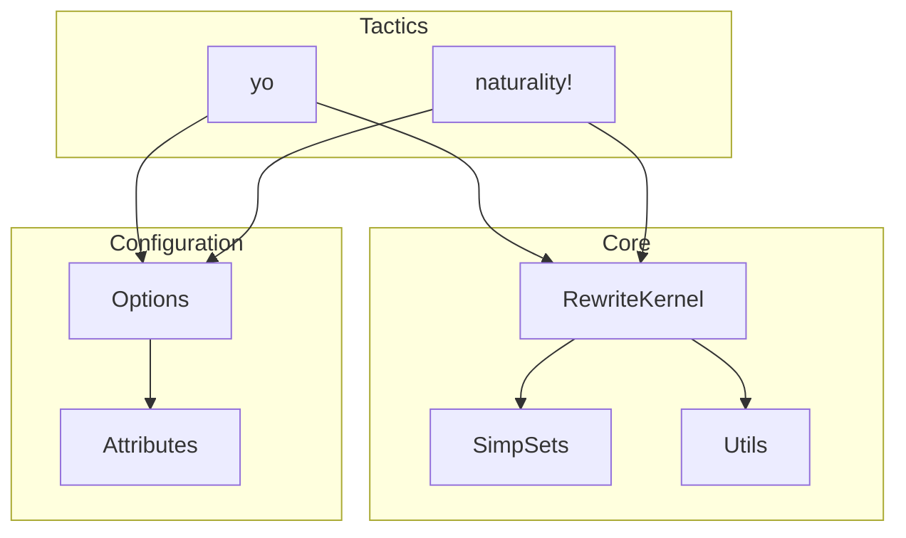

<div align="center">

# LeanYo

**Category theory tactics for Lean 4 — Yoneda rewrites and naturality automation**

[](https://opensource.org/licenses/MIT)
[](https://leanprover-community.github.io/)
[](https://github.com/leanprover-community/mathlib4)
[](https://github.com/fraware/lean-yo/actions/workflows/ci.yml)

<br />

*Functoriality, naturality squares, and whiskering — with tactics that stay explicit when you need them to.*

</div>

---

## Contents

- [At a glance](#at-a-glance) — overview and architecture
- [Get started](#get-started) — Docker, Lake, or clone
- [Examples](#examples) — tactics, debug, options
- [Extending LeanYo](#extending-leanyo) — attributes
- [Choosing a tactic](#choosing-a-tactic)
- [Troubleshooting](#troubleshooting) — pitfalls, performance, Make
- [Contributing](#contributing)
- [Compatibility and license](#compatibility-and-license)

---

## At a glance

LeanYo adds proof automation for common **category theory** patterns in [Lean 4](https://leanprover.github.io/) and [Mathlib](https://github.com/leanprover-community/mathlib4):

| Capability | What it does |
|:---|:---|
| **`yo`** | Rewrites morphism goals using (co)Yoneda-style isomorphisms toward more manageable forms |
| **`naturality!`** | Closes many standard **naturality squares** and **whiskering** goals |
| **`yo?` / `naturality?`** | Show the rewrite trail when you need to see what happened |
| **Options** | Direction for `yo`, step limits and timeouts for `naturality!` |

The implementation is split into tactics, a rewrite kernel, tuned simp sets, and a small options layer so behavior stays predictable on large goals.


```mermaid
flowchart TB
  subgraph tg [Tactics]
    Y[yo]
    N[naturality!]
  end
  subgraph cr [Core]
    K[RewriteKernel]
    S[SimpSets]
    U[Utils]
  end
  subgraph cf [Configuration]
    O[Options]
    A[Attributes]
  end
  Y --> K
  N --> K
  K --> S
  K --> U
  Y --> O
  N --> O
  O --> A
```

---

## Get started

### Docker

No local Lean install required:

```bash
docker run --rm ghcr.io/fraware/lean-yo:latest --help
docker run --rm ghcr.io/fraware/lean-yo:latest --examples
```

Typecheck a file in your tree (mount the directory):

```bash
docker run --rm -v "$(pwd):/workspace" ghcr.io/fraware/lean-yo:latest /workspace/MyProof.lean
```

Interactive shell:

```bash
docker run -it --rm -v "$(pwd):/workspace" ghcr.io/fraware/lean-yo:latest bash
```

### Add to your Lean project

In `lakefile.lean`:

```lean
require lean-yo from git "https://github.com/fraware/lean-yo.git"
```

Pin a tag or revision when you care about reproducibility:

```lean
require lean-yo from git "https://github.com/fraware/lean-yo.git" @ "v1.0.0"
```

Then:

```bash
lake update
lake build
```

In your `.lean` files:

```lean
import LeanYo
```

### Work on this repository

```bash
git clone https://github.com/fraware/lean-yo.git
cd lean-yo
make dev    # lake update + build
make run    # build + check examples
make test   # full checks (tests + helper scripts)
```

For a full verification without Make, see [CONTRIBUTING.md](CONTRIBUTING.md) (same steps `make test` runs).

---

## Examples

### `yo` — functoriality and maps

```lean
import LeanYo

example {C D : Type} [Category C] [Category D] (F : C ⥤ D) (X : C) :
    F.map (𝟙 X) = 𝟙 (F.obj X) := by
  yo
```

### `naturality!` — squares and whiskering

```lean
example {C D : Type} [Category C] [Category D] (F G : C ⥤ D) (η : F ⟶ G) (X Y : C) (f : X ⟶ Y) :
    η.app X ≫ G.map f = F.map f ≫ η.app Y := by
  naturality!
```

### Debug variants

```lean
example {C D : Type} [Category C] [Category D] (F : C ⥤ D) (X : C) :
    F.map (𝟙 X) = 𝟙 (F.obj X) := by
  yo?
```

### Hypotheses

```lean
example {C D : Type} [Category C] [Category D] (F : C ⥤ D) (X : C)
    (h : F.map (𝟙 X) = 𝟙 (F.obj X)) :
    F.map (𝟙 X) = 𝟙 (F.obj X) := by
  yo at h

example {C D : Type} [Category C] [Category D] (F G : C ⥤ D) (η : F ⟶ G) (X Y : C) (f : X ⟶ Y)
    (h : η.app X ≫ G.map f = F.map f ≫ η.app Y) :
    η.app X ≫ G.map f = F.map f ≫ η.app Y := by
  naturality! at h
```

### Options

```lean
yo.direction := auto           -- default: let the tactic choose
yo.direction := covariant
yo.direction := contravariant

naturality.maxSteps := 64        -- default
naturality.timeout := 1500ms     -- default
```

---

## Extending LeanYo

Register lemmas the tactics can use:

**`@[naturality]`** — naturality-style equations for `naturality!`:

```lean
@[naturality]
theorem my_naturality_lemma {C D : Type} [Category C] [Category D]
    (F G : C ⥤ D) (η : F ⟶ G) (X Y : C) (f : X ⟶ Y) :
    η.app X ≫ G.map f = F.map f ≫ η.app Y := by
  sorry
```

**`@[yo.fuse]`** — fusion rules for `yo` (maps, composition, whiskers):

```lean
@[yo.fuse]
theorem my_fusion_lemma {C D : Type} [Category C] [Category D]
    (F : C ⥤ D) (X Y Z : C) (f : X ⟶ Y) (g : Y ⟶ Z) :
    F.map (f ≫ g) = F.map f ≫ F.map g := by
  sorry
```

---

## Choosing a tactic

| Situation | Reach for |
|-----------|-----------|
| Functor maps, composition through `F.map`, Yoneda-style rewrites | **`yo`** |
| Naturality squares, `η.app …`, whiskering, NT composition | **`naturality!`** |
| Unsure what fired | **`yo?`** / **`naturality?`** |

More detail: [Usage guide](docs/USAGE_GUIDE.md) · [API reference](docs/API_REFERENCE.md)

---

## Troubleshooting

### Common issues

| Issue | What to try |
|-------|-------------|
| Too many rewrites or loops | `yo?` / `naturality?`; tighten `maxSteps` or `timeout` |
| Wrong Yoneda direction | `yo.direction := auto` first, then pin `covariant` / `contravariant` if needed |
| Timeouts on big diagrams | Raise `naturality.timeout` modestly; register narrower `@[naturality]` lemmas |

### Performance

Search is bounded (`naturality.maxSteps`, `naturality.timeout`). For heavy proofs, tune locally and register only the lemmas you need.

### Tests and Make targets

```bash
make test        # full suite
make quick-test  # library build only
make check-deps  # toolchain sanity
```

<details>
<summary><strong>All Make targets</strong> (click to expand)</summary>

| Command | Description |
|---------|-------------|
| `make dev` | `lake update` + `lake build` |
| `make run` | Build + check examples |
| `make test` | Full tests and project checks |
| `make build` | Build the library |
| `make clean` | Clean artifacts |
| `make release` | Release flow (`DRY_RUN=1` supported) |
| `make docker-build` | Build the image locally |
| `make docker-push` | Push image (auth required) |
| `make docker-run` | Run container help |
| `make ci` | Local pipeline approximation |
| `make help` | List targets |

</details>

```bash
make docker-build   # build image
make docker-run     # run `--help`
```

---

## Contributing

See **[CONTRIBUTING.md](CONTRIBUTING.md)** for Mathlib pins, review expectations, and documentation updates.

1. Fork and branch from `main`
2. Add or extend tests in `LeanYo.Tests.P0` / `P1` / `P2` when behavior changes
3. Run **`make test`** before opening a PR
4. Update `README.md` or `docs/` if users see different behavior

```bash
git clone https://github.com/yourusername/lean-yo.git
cd lean-yo
make dev && make test
```

---

## Compatibility and license

| Item | Where to look |
|:---|:---|
| **Lean** | [lean-toolchain](lean-toolchain) |
| **Mathlib** | [lakefile.lean](lakefile.lean) · [lake-manifest.json](lake-manifest.json) |
| **License** | [MIT](LICENSE) |

---

<div align="center">

**LeanYo**

[Issues](https://github.com/fraware/lean-yo/issues) · [Docs](https://github.com/fraware/lean-yo/tree/main/docs) · [Contributing](CONTRIBUTING.md)

</div>
